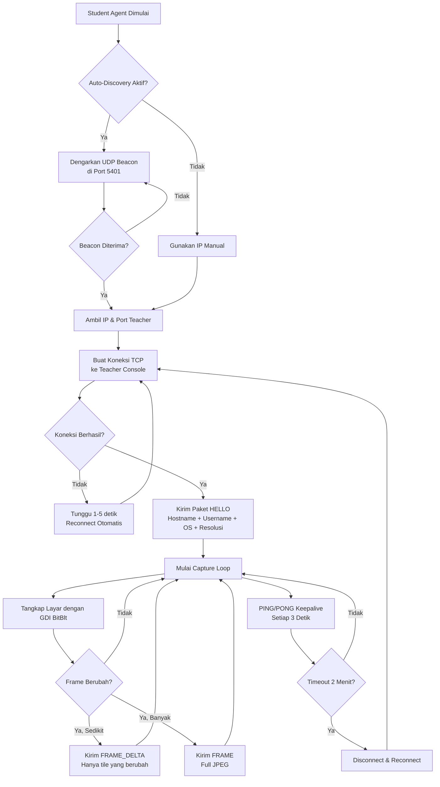

<p align="center">
  
</p>

<h1 align="center">Simanta</h1>
<p align="center">
  <b>Sistem Informasi Manajemen dan Pemantauan Laboratorium</b><br>
  <i>Classroom Management System berbasis jaringan lokal (LAN)</i>
</p>

<p align="center">
  
  
  
  
  
</p>

---

##  Deskripsi

**Simanta** adalah perangkat lunak manajemen laboratorium komputer yang memungkinkan pengajar (guru/dosen) untuk memantau dan mengelola seluruh komputer siswa secara *real-time* melalui jaringan lokal (LAN). Sistem ini dibangun menggunakan arsitektur **Client-Server** dengan protokol biner kustom yang berjalan di atas TCP/IP.

Aplikasi ini terdiri dari dua komponen utama:
- **Teacher Console** — Antarmuka grafis bagi pengajar untuk memantau layar siswa, mengirim pesan, mengelola file, dan mengontrol komputer siswa.
- **Student Agent** — Agen *background* yang berjalan di komputer siswa, menangkap layar secara berkala dan mengirimkannya ke Teacher Console.

---

##  Fitur Utama

| Kategori | Fitur | Keterangan |
|----------|-------|------------|
| 🖥️ **Pemantauan** | Screen Capture Real-time | Menampilkan tangkapan layar siswa secara *live* dengan dukungan *delta encoding* (hanya mengirim bagian yang berubah) |
| 🖥️ **Pemantauan** | Fullscreen View | Melihat layar siswa secara penuh dengan mode resolusi tinggi |
| 🖥️ **Pemantauan** | Adaptive Quality | Kualitas gambar menyesuaikan kondisi jaringan secara otomatis |
| 💬 **Komunikasi** | Broadcast Message | Mengirim pesan popup ke seluruh atau sebagian siswa |
| 💬 **Komunikasi** | Chat Pribadi | Obrolan dua arah antara guru dan siswa |
| 💬 **Komunikasi** | Help Request | Siswa dapat mengirim permintaan bantuan ke guru |
| 🔒 **Kontrol** | Lock/Unlock Screen | Mengunci layar siswa agar tidak dapat digunakan |
| 🔒 **Kontrol** | Kirim URL | Membuka halaman web tertentu di browser seluruh siswa |
| 🔒 **Kontrol** | Disconnect/Kick | Memutus koneksi siswa tertentu dari sesi monitoring |
| 📁 **File** | Transfer File & Folder | Mengirim file/folder dari guru ke komputer siswa |
| 📁 **File** | Retrieve File | Mengambil file dari komputer siswa ke komputer guru |
| 📁 **File** | Remote Directory Browsing | Menjelajahi isi folder di komputer siswa |
| 🔍 **Discovery** | Auto-Discovery (UDP) | Student Agent menemukan Teacher Console secara otomatis tanpa konfigurasi IP manual |
| 🔍 **Discovery** | Auto-Reconnect | Koneksi otomatis pulih saat jaringan terputus sementara |

---

## 🏗️ Arsitektur Sistem

### Diagram Alur Komunikasi

```
┌─────────────────────────────┐          TCP (Port 5400)          ┌──────────────────────────┐
│                             │◄────────────────────────────────► │                          │
│     TEACHER CONSOLE         │                                   │     STUDENT AGENT        │
│     (SimantaTeacher.exe)    │          UDP (Port 5401)          │    (SimantaStudent.exe)  │
│                             │─────────── Beacon ──────────────► │                          │
│  ┌─────────┐ ┌───────────┐  │                                   │  ┌──────────────────┐    │
│  │ Toolbar ││  Sidebar   │  │  Protokol:                        │  │ Screen Capturer  │    │
│  ├─────────┤ ├───────────┤  │  ► HELLO (Registrasi)             │  │ (GDI + BitBlt)   │    │
│  │ Student │ │ Internet  │  │  ► FRAME/FRAME_DELTA (Screenshot) │  ├──────────────────┤    │
│  │  Grid   │ │ Security  │  │  ► PING/PONG (Keepalive)          │  │ File Handler     │    │
│  │         │ │ Settings  │  │  ► MESSAGE/CHAT (Komunikasi)      │  ├──────────────────┤    │
│  │  Tiles  │ │           │  │  ► LOCK/UNLOCK (Kontrol)          │  │ Student Panel    │    │
│  └─────────┘ └───────────┘  │  ► TRANSFER (File)                │  │ (Floating UI)    │    │
│  ┌─────────────────────┐    │  ► DIR_LIST (Direktori)           │  └──────────────────┘    │
│  │     Status Bar      │    │  ► HELP_REQUEST (Bantuan)         │                          │
│  └─────────────────────┘    │  ► KICK (Putus Koneksi)           │                          │
└─────────────────────────────┘                                   └──────────────────────────┘
```

### Flowchart Koneksi



---

## Teknologi yang Digunakan

| Komponen | Teknologi | Versi |
|----------|-----------|-------|
| **Bahasa Pemrograman** | C++ | C++17 |
| **Framework GUI** | Qt | 6.x |
| **Build System** | CMake | 3.16+ |
| **Screen Capture** | Windows GDI (BitBlt) | - |
| **Protokol Jaringan** | TCP/IP + UDP (Custom Binary Protocol) | - |
| **Kompresi Gambar** | JPEG (via Qt) | - |
| **Installer** | Inno Setup | 6.x |
| **CI/CD** | GitHub Actions | - |
| **Compiler** | MSVC 2019/2022 atau MinGW | - |

---

##  Struktur Direktori

```
Simanta/
├── CMakeLists.txt              # Konfigurasi build utama (CMake)
├── setup_dist.iss              # Script installer (Inno Setup)
│
├── common/                     # Pustaka bersama (shared library)
│   ├── CMakeLists.txt
│   ├── protocol.h              # Definisi protokol komunikasi (header & tipe pesan)
│   ├── protocol.cpp            # Implementasi serialisasi/deserialisasi paket
│   └── lang.h                  # Sistem bahasa (ID/EN)
│
├── student/                    # Aplikasi Student Agent
│   ├── CMakeLists.txt
│   ├── main.cpp                # Entry point + UI panel siswa (floating widget)
│   ├── screen_capturer.h       # Header screen capture engine
│   ├── screen_capturer.cpp     # Implementasi GDI capture + delta encoding
│   ├── student_agent.h         # Header agen koneksi siswa
│   ├── student_agent.cpp       # Implementasi TCP client + auto-discovery
│   ├── app.rc                  # Windows resource (ikon .exe)
│   └── logo.ico                # Ikon aplikasi
│
├── teacher/                    # Aplikasi Teacher Console
│   ├── CMakeLists.txt
│   ├── main.cpp                # Entry point aplikasi guru
│   ├── tutor_window.h/cpp      # Jendela utama (toolbar, sidebar, grid, status bar)
│   ├── connection_manager.h/cpp# Manajemen koneksi TCP server + UDP beacon
│   ├── student_grid.h/cpp      # Grid tampilan thumbnail siswa (flow layout)
│   ├── student_tile.h/cpp      # Kartu individual siswa (screenshot + info)
│   ├── toolbar_widget.h/cpp    # Toolbar ribbon (tombol aksi utama)
│   ├── sidebar_widget.h/cpp    # Sidebar navigasi (ikon)
│   ├── styles.h                # Definisi tema dan warna UI
│   ├── app.rc                  # Windows resource (ikon .exe)
│   └── resources/              # Aset grafis (ikon SVG + ICO)
│       ├── resources.qrc
│       └── icons/
│
└── installer/                  # Aset installer
    └── logo.ico                # Ikon installer
```

---

##  Tangkapan Layar

### Teacher Console
#### Teacher Console - Main View


#### Teacher Console - Chat View


### Student Agent
#### Student Agent - Panel View


### Installer
#### Installer - Role Selection


---

## ⚙️ Cara Build dari Source Code

### Prasyarat

1. **Qt 6.x** — [Download Qt](https://www.qt.io/download)
2. **CMake 3.16+** — [Download CMake](https://cmake.org/download/)
3. **Compiler C++17** — MSVC 2019/2022 atau MinGW
4. **Inno Setup 6** *(opsional, untuk membuat installer)* — [Download](https://jrsoftware.org/isinfo.php)

### Langkah Build

```bash
# 1. Clone repository
git clone https://github.com/otsolain/Simanta.git
cd Simanta

# 2. Buat folder build
cmake -B build -DCMAKE_PREFIX_PATH="C:/Qt/6.x.x/msvc2022_64"

# 3. Kompilasi
cmake --build build --config Release

# 4. Hasil build
#    build/teacher/SimantaTeacher.exe
#    build/student/SimantaStudent.exe
```

### Membuat Installer

```bash
# Pastikan Inno Setup 6 sudah terinstall
# Jalankan windeployqt terlebih dahulu untuk menyalin DLL Qt
windeployqt --release dist/teacher/SimantaTeacher.exe
windeployqt --release dist/student/SimantaStudent.exe

# Kompilasi installer
iscc setup_dist.iss
# Output: installer_output/Simanta.exe
```

---

##  Cara Penggunaan

### Instalasi
1. Download file `Simanta.exe` dari halaman [Releases](https://github.com/otsolain/Simanta/releases).
2. Jalankan installer dan pilih mode instalasi:
   - **Guru (Teacher)** — untuk komputer pengajar.
   - **Murid (Student)** — untuk komputer siswa di laboratorium.
3. Installer akan otomatis mengatur *Firewall Rules* dan *Auto-Startup* (khusus Student).

### Menjalankan
- **Teacher Console**: Buka dari Start Menu atau Desktop shortcut.
- **Student Agent**: Berjalan otomatis di *background* saat Windows dinyalakan. Panel kecil akan muncul di sudut kanan bawah layar siswa.

### Alur Kerja
1. Guru membuka **Teacher Console** di komputernya.
2. Student Agent di komputer siswa akan otomatis menemukan Teacher Console melalui **UDP Auto-Discovery**.
3. Setelah terhubung, layar siswa akan muncul sebagai *thumbnail* di grid Teacher Console.
4. Guru dapat melakukan berbagai aksi: memantau layar, mengirim pesan, mengunci layar, transfer file, dan lain-lain.

---

## 📡 Protokol Komunikasi

Simanta menggunakan **protokol biner kustom** yang terdiri dari:

### Format Header Paket (12 byte)

| Offset | Ukuran | Field | Keterangan |
|--------|--------|-------|------------|
| 0 | 2 byte | Magic | `0xABCD` — penanda awal paket |
| 2 | 2 byte | MsgType | Tipe pesan (lihat tabel di bawah) |
| 4 | 4 byte | PayloadLength | Panjang data setelah header |
| 8 | 4 byte | Reserved | Dicadangkan untuk pengembangan |

### Tipe Pesan

| Kode | Nama | Arah | Fungsi |
|------|------|------|--------|
| `0x01` | HELLO | Student → Teacher | Registrasi identitas siswa |
| `0x02` | FRAME | Student → Teacher | Screenshot penuh (JPEG) |
| `0x06` | FRAME_DELTA | Student → Teacher | Screenshot diferensial (tile 64×64 px) |
| `0x04` | PING | Dua Arah | Keepalive request |
| `0x05` | PONG | Dua Arah | Keepalive response |
| `0x11` | MESSAGE | Teacher → Student | Popup pesan teks |
| `0x12` | LOCK_SCREEN | Teacher → Student | Kunci layar siswa |
| `0x15` | CHAT_MSG | Dua Arah | Pesan obrolan |
| `0x16` | HELP_REQUEST | Student → Teacher | Permintaan bantuan |
| `0x20-0x22` | TRANSFER | Teacher → Student | Transfer file |
| `0x30-0x36` | DIR/RETRIEVE | Dua Arah | Manajemen file jarak jauh |

---

